# Mallify Microservices Architecture

## Architecture Diagram

```mermaid
graph TB
    subgraph Clients["Client Applications"]
        WebAdmin["Admin Dashboard :3337"]
        WebManager["Manager Dashboard :3335"]
        WebStore["Store Dashboard :3333"]
        WebHome["Landing Page :3000"]
        MobileClient["Client Mobile App"]
        MobileDriver["Driver Mobile App"]
    end

    subgraph APILayer["API Layer"]
        Gateway["API Gateway :4000"]
    end

    subgraph CoreServices["Core Services"]
        UserService["User Service :3001"]
        ProductService["Product Service :3002"]
        BoutiqueService["Boutique Service :3003"]
        OrderService["Order Service :3004"]
    end

    subgraph Financial["Payment & Financial"]
        PaymentService["Payment Service :3005"]
        PromotionService["Promotion Service :3011"]
    end

    subgraph Logistics["Logistics"]
        DeliveryService["Delivery Service :3006"]
        DriverService["Driver Service :3007"]
    end

    subgraph Communication["Communication"]
        NotificationService["Notification Service :3008"]
        ChatService["Chat Service :3009"]
    end

    subgraph Engagement["Engagement"]
        ReviewService["Review Service :3010"]
        WishlistService["Wishlist Service :3012"]
    end

    subgraph Monitoring["Management & Monitoring"]
        AnalyticsService["Analytics Service :3013"]
        AuditService["Audit Service :3014"]
        DisputeService["Dispute Service :3015"]
    end

    subgraph Database["Data Layer"]
        MongoDB[("MongoDB :27017")]
    end

    WebAdmin --> Gateway
    WebManager --> Gateway
    WebStore --> Gateway
    WebHome --> Gateway
    MobileClient --> Gateway
    MobileDriver --> Gateway

    Gateway --> UserService
    Gateway --> ProductService
    Gateway --> BoutiqueService
    Gateway --> OrderService
    Gateway --> PaymentService
    Gateway --> DeliveryService
    Gateway --> DriverService
    Gateway --> NotificationService
    Gateway --> ChatService
    Gateway --> ReviewService
    Gateway --> PromotionService
    Gateway --> WishlistService
    Gateway --> AnalyticsService
    Gateway --> AuditService
    Gateway --> DisputeService

    UserService --> MongoDB
    ProductService --> MongoDB
    BoutiqueService --> MongoDB
    OrderService --> MongoDB
    PaymentService --> MongoDB
    DeliveryService --> MongoDB
    DriverService --> MongoDB
    NotificationService --> MongoDB
    ChatService --> MongoDB
    ReviewService --> MongoDB
    PromotionService --> MongoDB
    WishlistService --> MongoDB
    AnalyticsService --> MongoDB
    AuditService --> MongoDB
    DisputeService --> MongoDB

    OrderService -.-> PaymentService
    OrderService -.-> DeliveryService
    OrderService -.-> NotificationService
    PaymentService -.-> NotificationService
    DeliveryService -.-> DriverService
    DeliveryService -.-> NotificationService
    ReviewService -.-> NotificationService
    DisputeService -.-> NotificationService
    ChatService -.-> NotificationService

    style WebAdmin fill:#e1f5fe,stroke:#01579b,stroke-width:2px
    style WebManager fill:#e1f5fe,stroke:#01579b,stroke-width:2px
    style WebStore fill:#e1f5fe,stroke:#01579b,stroke-width:2px
    style WebHome fill:#e1f5fe,stroke:#01579b,stroke-width:2px
    style MobileClient fill:#e1f5fe,stroke:#01579b,stroke-width:2px
    style MobileDriver fill:#e1f5fe,stroke:#01579b,stroke-width:2px
    style Gateway fill:#fff3e0,stroke:#e65100,stroke-width:3px
    style MongoDB fill:#e8f5e9,stroke:#1b5e20,stroke-width:2px
```



## Service Ports Mapping

### Frontend Applications
| Application | Port | Purpose |
|------------|------|---------|
| Landing Page | 3000 | Public-facing home page |
| Store Dashboard | 3333 | Boutique owner management |
| Manager Dashboard | 3335 | Delivery/Platform manager portal |
| Admin Dashboard | 3337 | System administration |
| Client Mobile | Expo | Customer mobile app |
| Driver Mobile | Expo | Driver mobile app |

### Backend Services
| Service | Port | Responsibilities |
|---------|------|-----------------|
| API Gateway | 4000 | Entry point, auth, routing, rate limiting |
| User Service | 3001 | Authentication, user profiles, roles |
| Product Service | 3002 | Product catalog, inventory management |
| Boutique Service | 3003 | Store management, verification |
| Order Service | 3004 | Order processing, cart, fulfillment |
| Payment Service | 3005 | Transactions, payment processing |
| Delivery Service | 3006 | Delivery management, tracking |
| Driver Service | 3007 | Driver assignment, performance |
| Notification Service | 3008 | Push, email, SMS notifications |
| Chat Service | 3009 | Real-time messaging, support |
| Review Service | 3010 | Ratings, reviews, feedback |
| Promotion Service | 3011 | Discounts, coupons, campaigns |
| Wishlist Service | 3012 | User wishlists, recommendations |
| Analytics Service | 3013 | Metrics, reports, insights |
| Audit Service | 3014 | Audit logs, compliance tracking |
| Dispute Service | 3015 | Dispute resolution, claims |

### Database
| Database | Port | Purpose |
|----------|------|---------|
| MongoDB | 27017 | Primary data store |

## Architecture Patterns

### 1. API Gateway Pattern
- Single entry point for all clients
- Handles authentication and authorization
- Routes requests to appropriate microservices
- Implements rate limiting and security measures

### 2. Microservices Pattern
- Each service is independent and deployable
- Services communicate via REST APIs
- Event-driven communication for async operations
- Shared utilities via `@mallify/shared` package

### 3. Database Per Service
- Each microservice has its own MongoDB collections
- Services own their data
- No direct database access between services

### 4. Event-Driven Architecture
- Services emit events for state changes
- Asynchronous processing for decoupling
- Used for notifications, analytics, and auditing

## Technology Stack

### Frontend
- **React 18** - Web applications (Admin, Manager, Store, Home)
- **React Native + Expo** - Mobile applications
- **React Router** - Client-side routing
- **Axios** - HTTP client

### Backend
- **Node.js + Express** - All microservices
- **TypeScript** - Type safety and better DX
- **MongoDB + Mongoose** - Database and ODM
- **JWT** - Authentication tokens
- **CORS** - Cross-origin resource sharing
- **Helmet** - Security headers
- **Rate Limiting** - API protection

### DevOps
- **Docker** - Containerization (docker-compose.yml)
- **npm workspaces** - Monorepo management
- **nodemon** - Development hot reload

## Communication Flows

### Authentication Flow
```
Client → API Gateway → User Service → MongoDB
         ↓
    JWT Token
         ↓
    Client (stores token)
```

### Order Placement Flow
```
Client → API Gateway → Order Service → MongoDB
                           ↓
                     [Event Emitted]
                           ↓
         ┌─────────────────┼─────────────────┐
         ↓                 ↓                 ↓
    Payment Service   Delivery Service   Notification Service
         ↓                 ↓                 ↓
      MongoDB           MongoDB         Push/Email/SMS
```

### Real-time Chat Flow
```
Client → API Gateway → Chat Service (WebSocket)
                           ↓
                       MongoDB
                           ↓
                    Notification Service
```

## Deployment

### Development
```bash
# Start all services
./start-dev.cmd

# Or start individually
cd services/api-gateway && npm run dev
cd services/user-service && npm run dev
# ... etc
```

### Production Considerations
1. **Load Balancing** - Use nginx or cloud load balancer for Gateway
2. **Service Discovery** - Consider Consul or Kubernetes services
3. **Monitoring** - Add Prometheus, Grafana
4. **Logging** - Centralized logging (ELK stack)
5. **Container Orchestration** - Kubernetes or Docker Swarm
6. **Database** - MongoDB cluster with replica sets
7. **Caching** - Add Redis for session management
8. **Message Queue** - Add RabbitMQ or Kafka for events

## Security Features

- **JWT Authentication** - Token-based auth
- **CORS Protection** - Configured allowed origins
- **Rate Limiting** - Prevent abuse
- **Helmet.js** - Security headers
- **Input Validation** - Request validation middleware
- **Role-Based Access Control** - Admin, Manager, Boutique, Customer, Driver roles

## Future Enhancements

1. **Service Mesh** - Istio for advanced traffic management
2. **API Versioning** - Support multiple API versions
3. **GraphQL Gateway** - Alternative to REST
4. **Elasticsearch** - Advanced search capabilities
5. **Redis Cache** - Performance optimization
6. **CI/CD Pipeline** - Automated testing and deployment
7. **Health Checks** - Auto-recovery and monitoring
8. **Blue-Green Deployment** - Zero-downtime updates
