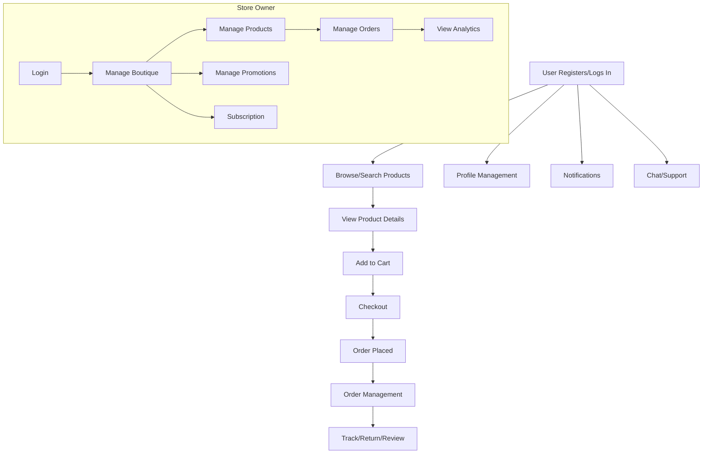

# Mallify Project – Unified Exploration & Context File

## 1. Architecture Overview
[//]: # (---- ACTORS SECTION ----)
## 1A. Actors (Roles) in the Mallify System

The following actors interact with the Mallify platform. Each actor represents a distinct role with specific permissions and responsibilities:

- **Client (Customer):** End-user who browses products, places orders, manages their profile, and interacts with boutiques and support.
- **Store Owner:** Manages a boutique, including products, orders, inventory, promotions, analytics, and communication with customers.
- **Store Manager:** Oversees multiple boutiques, approves/rejects boutiques and products, ensures compliance, and manages platform-level analytics and promotions.
- **Order Manager:** Handles delivery logistics, assigns drivers, manages order fulfillment, resolves delivery issues, and oversees delivery analytics.
- **Admin:** Has full system access for global management of users, boutiques, orders, analytics, audit logs, and system configuration.
- **Driver:** Responsible for picking up and delivering orders, updating delivery status, and managing their own performance and schedule.
- **Support Agent:** Provides customer service via chat/support channels, resolves disputes, and assists with order or account issues.
- **Auditor/Compliance Officer:** Reviews audit logs, monitors compliance, and ensures regulatory requirements are met (may overlap with Admin).
- **System Integrations (External Services):** Third-party services or automated agents that interact with the platform for payments, notifications, analytics, etc.

> **Note:** Some actors (e.g., Support Agent, Auditor) may be implemented as specific roles within the Admin dashboard or as dedicated user types, depending on system configuration.

---
- Microservices-based backend (Node.js/Express for each service)
- API Gateway as main entry point (auth, routing, security)
- MongoDB for data persistence (per-service collections)
- Event-driven communication (RabbitMQ)
- JWT authentication, role-based access control
- Dockerized deployment, npm workspaces for monorepo

## 2. Main Components
### Backend Services
- user-service: Auth, users, roles, profiles
- product-service: Products, categories, inventory
- order-service: Orders, cart, returns
- boutique-service: Boutique management, subscriptions
- payment-service: Payments, transactions
- delivery-service: Deliveries, tracking
- driver-service: Drivers, onboarding, performance
- review-service: Product/boutique reviews
- notification-service: Push/email/SMS
- chat-service: Real-time messaging
- promotion-service: Promotions, discounts
- wishlist-service: Wishlists
- analytics-service: Analytics, reports, AI
- audit-service: Audit logs, compliance
- dispute-service: Disputes, returns
- message-broker-service: Event bus
- shared: Shared utilities, types

### Web Frontends
- **Admin Dashboard (web/admin):**
  - Users, boutiques, orders, analytics, audit, notifications, settings
- **Store Owner Dashboard (web/store):**
  - Boutique, products, orders, promotions, analytics, communication, subscription
- **Store Manager Dashboard (web/manager/store):**
  - All boutiques, approvals, compliance, analytics, promotions, products
- **Order Manager Dashboard (web/manager/order):**
  - Deliveries, drivers, analytics, financial, logistics, communication
- **Home (web/home):**
  - Landing page, marketing

### Mobile App (app/client)
- React Native/Expo
- Screens: Home, Search, Product, Cart, Checkout, Orders, Profile, Wishlist, Notifications, Customer Service, Wallet, etc.
- API integration via shopApi.ts

## 3. Key Features by Role
- **Client:** Browse/search products, manage cart, place orders, track orders, manage profile/addresses, wishlist, reviews, notifications, payments, chat, loyalty, promotions
- **Store Owner:** Manage boutique, products, orders, inventory, promotions, analytics, communication, subscription
- **Store Manager:** Oversee boutiques, approve/reject, compliance, analytics, manage promotions/products
- **Order Manager:** Manage deliveries, drivers, performance, financials, logistics, communication
- **Admin:** Global user/boutique/order management, analytics, audit, system settings

## 4. API & Data Flows
- All frontends communicate via REST APIs through the API Gateway
- JWT tokens for authentication, role-based access enforced
- Each service exposes its own endpoints (see package/src for details)
- Web and app frontends have dedicated API clients

## 5. Notable Patterns
- Three-tier architecture: Presentation (web/app), Business Logic (services), Data (MongoDB)
- Microservices: Each service is independent, scalable, and owns its data
- Event-driven: RabbitMQ for async events (notifications, analytics, etc.)
- Docker for local/dev/prod deployment

## 6. To Update
- Add new features, endpoints, or flows as discovered
- Update with new services, screens, or architectural changes
- Use as a living context file for all future exploration

---

## 7. Store Owner Dashboard – Analytics & Product Management (web/store)

### Analytics Features
- **Sales Analytics Overview:**
  - KPIs: Total Revenue, Total Orders, Average Order Value, Unique Customers (computed from completed orders)
  - Recent Orders Table: Order number, customer, amount, status, date (last 10 orders)
  - Top Products: Hardcoded sample, but intended for best sellers by sales/revenue
  - Order Distribution: Online vs. In-Store (visualized as progress bars)
  - Error and loading states handled
- **Sales Analytics (Trends):**
  - Time range selection (last 6 months, year, all time)
  - Monthly breakdown: Revenue, orders, average order, growth
  - Top products by revenue/units sold
  - Order status distribution (visualized as progress bars)
- **Reports & Analytics Reports:**
  - Generate new reports (sales, revenue, customers, products, inventory) for selectable date ranges and formats (PDF, Excel, CSV, JSON)
  - Download recent reports (with type, date, format, size)
  - Schedule automated reports (daily, weekly, monthly, email delivery)
  - Quick stats: total reports generated, this month, scheduled, last generated

### Product Management Features
- **All Products:**
  - List, search, filter (by status/category), and paginate products
  - Product stats: total, active, low stock, out of stock
  - Actions: View, Edit, Delete (with confirmation)
  - Add Product button
- **Add Product:**
  - Form for all product details: name, category, description, tags, custom attributes
  - Image upload (up to 10, 5MB each, PNG/JPG)
  - Pricing: price, compare at price (for discounts)
  - Inventory: SKU, barcode, stock, low stock threshold
  - Status: active, draft, archived, suspended
  - Variants: enable/disable, add multiple variants (name, SKU, price, compare price, color, sizes, attributes)
  - Variant inventory by size, color picker, preset/custom sizes
  - Save as draft or publish
- **Edit Product:**
  - Same as Add Product, but pre-filled and allows updating all fields/images/variants
- **Inventory & Alerts:**
  - Inventory dashboard: total, low stock, out of stock, in stock
  - Low stock and out of stock tables with restock actions
  - Inventory settings: low stock threshold, email notifications, auto restock requests
- **Inventory Alerts:**
  - Duplicate of Inventory, focused on alerting for low/out of stock
- **Products List:**
  - Table/grid view toggle, search, filter, sort, pagination
  - Status chips: live, draft, suspended, out of stock, low stock
  - Product images, boutique/store name, last updated
  - Actions: view, edit, delete (with toast/confirmation)

### UI/UX Patterns
- Consistent use of cards, tables, stats grids, and responsive layouts
- Status badges and color coding for quick visual feedback
- Toast notifications for actions (success, error, info)
- Loading and empty states for all major views
- Modular, reusable form and table components

---

## 8. User Flows, Main Endpoints, and Features

### A. User Flows (High-Level)

#### 1. Client (App/Web)
- **Authentication:** Register, login, logout, password reset, email verification
- **Product Discovery:** Browse/search products, view product details, filter by category, add to wishlist
- **Cart & Checkout:** Add/remove items, manage cart, enter shipping address, select payment, place order
- **Order Management:** View order history, track order status, reorder, cancel/return
- **Profile & Addresses:** View/edit profile, manage addresses, change password
- **Notifications:** Receive order, promo, and system notifications
- **Reviews:** Submit/view product and boutique reviews
- **Promotions:** Apply promo codes, view active promotions
- **Chat/Support:** Message support or sellers

#### 2. Store Owner (Web)
- **Authentication:** Login/logout
- **Boutique Management:** View/edit boutique, manage subscription, upload images
- **Product Management:** List/add/edit/delete products, manage inventory, upload images, set variants
- **Order Management:** View/manage orders, update status, process returns
- **Analytics:** View sales, orders, customer stats, download/generate reports
- **Promotions:** Create/manage promotions
- **Communication:** Chat with customers, receive notifications

#### 3. Store Manager (Web)
- **Boutique Oversight:** Approve/reject boutiques, compliance checks
- **Product/Promotion Oversight:** Approve/reject products/promotions
- **Analytics:** View platform/boutique analytics

#### 4. Order Manager (Web)
- **Delivery Management:** Assign/manage deliveries, drivers
- **Order Oversight:** Track/resolve order issues, manage logistics
- **Analytics:** Delivery and performance stats

#### 5. Admin (Web)
- **User/Boutique/Order Management:** CRUD for all entities
- **Audit/Compliance:** View logs, system health, compliance
- **Settings:** System configuration, roles, permissions

### B. Main Endpoints (API Gateway & Services)

- **Auth:**
  - POST /api/auth/register, /login, /logout, /refresh, /forgot-password, /reset-password
- **Users:**
  - GET/PUT /api/users/profile, GET /api/users/:id, POST/PUT/DELETE /api/users/addresses
- **Products:**
  - GET /api/products, /:id, /boutique/:boutiqueId
  - POST/PUT/DELETE /api/products, /:id
  - POST /api/products/upload-images
- **Boutiques:**
  - GET /api/boutiques, /:id, /slug/:slug
  - POST/PUT/DELETE /api/boutiques, /:id
  - GET /api/boutiques/applications
  - Subscription: /api/boutiques/subscription-*
- **Orders:**
  - GET/POST /api/orders, /:id
  - PUT /api/orders/:id/status
  - POST /api/orders/store/:id/action
- **Payments:**
  - GET/POST /api/payments
- **Promotions:**
  - GET /api/promotions, /:id, /code/:code, /active
  - POST /api/promotions, /validate
- **Reviews:**
  - GET/POST /api/reviews, /:id
- **Messages/Chat:**
  - GET/POST /api/chat, /:id, /:id/read
- **Analytics:**
  - POST /api/analytics/events, /track
  - GET /api/analytics/statistics
- **Deliveries:**
  - GET/POST /api/deliveries, /:id
- **Notifications:**
  - POST /api/notifications/send-approval, /send-rejection
- **Subscription Plans:**
  - GET /api/boutiques/subscription-plans, /:id

### C. Main Features (Summary)

- **Authentication & Authorization** (JWT, role-based)
- **Product Catalog & Search**
- **Cart & Checkout**
- **Order Management & Tracking**
- **User Profile & Address Book**
- **Boutique & Inventory Management**
- **Promotions & Discounts**
- **Analytics & Reporting**
- **Notifications (Email, Push, SMS)**
- **Chat & Customer Support**
- **Subscription & Payments**
- **Admin & Manager Dashboards**
- **Audit, Compliance, Health Monitoring**

### D. User Flow Diagram (Textual)



---

## 9. Microservices Architecture Overview

### A. High-Level Architecture

- **API Gateway**: Central entry point for all client/web/app requests. Handles routing, authentication, rate limiting, logging, and error handling. Proxies requests to backend services.
- **Microservices** (Node.js/Express):
  - Each service is independently deployable, owns its own data, and exposes a REST API.
  - Services communicate via REST (synchronous) and RabbitMQ (asynchronous/events).
  - Each service has its own MongoDB collections.
- **Event Bus (RabbitMQ)**: Used for async events (order placed, notification, analytics, etc.) and decoupling services.
- **Database**: MongoDB (per-service collections, no joins, denormalized data where needed).
- **Shared Utilities**: Common types, validation, and helpers in a shared package.
- **Dockerized Deployment**: All services, gateway, and dependencies run in containers; orchestrated via docker-compose.

### B. Core Microservices

- **user-service**: Auth, user profiles, roles, addresses, registration, login, JWT, OAuth
- **product-service**: Products, categories, inventory, images, variants
- **order-service**: Orders, cart, returns, order status, order history
- **boutique-service**: Boutique CRUD, subscriptions, applications, images
- **payment-service**: Payments, transactions, integration with payment providers
- **delivery-service**: Deliveries, tracking, assignment, status
- **driver-service**: Driver onboarding, management, performance
- **review-service**: Product/boutique reviews, ratings
- **notification-service**: Email, push, SMS notifications
- **chat-service**: Real-time messaging, chat history
- **promotion-service**: Promotions, discounts, codes, validation
- **wishlist-service**: Wishlists, favorites
- **analytics-service**: Analytics events, reporting, KPIs
- **audit-service**: Audit logs, compliance, system events
- **dispute-service**: Disputes, returns, resolution
- **message-broker-service**: Event bus abstraction
- **shared**: Common code, types, validation

### C. Service Communication

- **REST**: API Gateway <-> Services, some service-to-service calls
- **Events**: Services publish/subscribe to events via RabbitMQ (e.g., order placed, payment completed, notification triggered)
- **Security**: JWT tokens for all requests, role-based access enforced at gateway and service level

### D. Deployment & Scaling

- **Docker Compose**: Local/dev orchestration
- **Horizontal Scaling**: Each service can be scaled independently
- **Stateless Services**: All business logic is stateless; state is in MongoDB or event bus
- **Health Checks**: Each service exposes /health endpoint

### E. Architecture Diagram (Textual)

```mermaid
graph TD
  ClientApp((Client App))
  WebApp((Web Dashboards))
  API[API Gateway]
  subgraph Services
    US[user-service]
    PS[product-service]
    OS[order-service]
    BS[boutique-service]
    PAY[payment-service]
    DS[delivery-service]
    DRV[driver-service]
    REV[review-service]
    NOTIF[notification-service]
    CHAT[chat-service]
    PROMO[promotion-service]
    WISH[wishlist-service]
    ANALYTICS[analytics-service]
    AUDIT[audit-service]
    DISPUTE[dispute-service]
    BROKER[message-broker-service]
  end
  MQ[(RabbitMQ)]
  DB[(MongoDB)]
  Shared[shared]

  ClientApp --> API
  WebApp --> API
  API --> US
  API --> PS
  API --> OS
  API --> BS
  API --> PAY
  API --> DS
  API --> DRV
  API --> REV
  API --> NOTIF
  API --> CHAT
  API --> PROMO
  API --> WISH
  API --> ANALYTICS
  API --> AUDIT
  API --> DISPUTE
  API --> BROKER
  US -- REST/Event --> MQ
  PS -- REST/Event --> MQ
  OS -- REST/Event --> MQ
  BS -- REST/Event --> MQ
  PAY -- REST/Event --> MQ
  DS -- REST/Event --> MQ
  DRV -- REST/Event --> MQ
  REV -- REST/Event --> MQ
  NOTIF -- REST/Event --> MQ
  CHAT -- REST/Event --> MQ
  PROMO -- REST/Event --> MQ
  WISH -- REST/Event --> MQ
  ANALYTICS -- REST/Event --> MQ
  AUDIT -- REST/Event --> MQ
  DISPUTE -- REST/Event --> MQ
  BROKER -- REST/Event --> MQ
  US -- DB
  PS -- DB
  OS -- DB
  BS -- DB
  PAY -- DB
  DS -- DB
  DRV -- DB
  REV -- DB
  NOTIF -- DB
  CHAT -- DB
  PROMO -- DB
  WISH -- DB
  ANALYTICS -- DB
  AUDIT -- DB
  DISPUTE -- DB
  BROKER -- DB
  Shared -.-> US
  Shared -.-> PS
  Shared -.-> OS
  Shared -.-> BS
  Shared -.-> PAY
  Shared -.-> DS
  Shared -.-> DRV
  Shared -.-> REV
  Shared -.-> NOTIF
  Shared -.-> CHAT
  Shared -.-> PROMO
  Shared -.-> WISH
  Shared -.-> ANALYTICS
  Shared -.-> AUDIT
  Shared -.-> DISPUTE
  Shared -.-> BROKER
```

---

*This file is maintained by GitHub Copilot as the unified context and knowledge base for the Mallify project. Any new discovery or change will be appended here for persistent context.*
